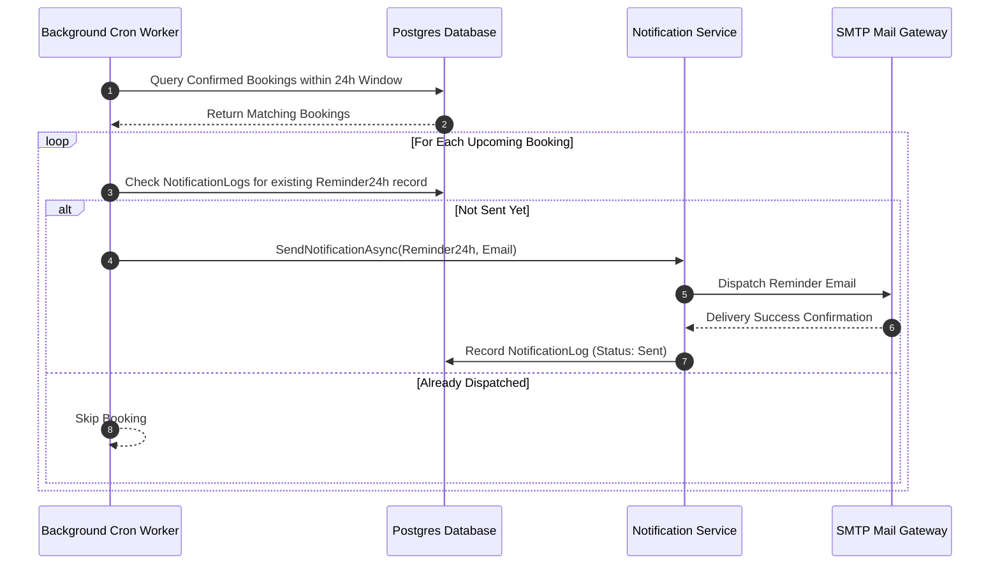

# Worker Engine Architecture & Reminders Dispatch

```mermaid
sequenceDiagram
    autonumber
    participant Cron as Background Cron Worker
    participant DB as Postgres Database
    participant NS as Notification Service
    participant Mail as SMTP Mail Gateway

    Cron->>DB: Query Confirmed Bookings within 24h Window
    DB-->>Cron: Return Matching Bookings
    loop For Each Upcoming Booking
        Cron->>DB: Check NotificationLogs for existing Reminder24h record
        alt Not Sent Yet
            Cron->>NS: SendNotificationAsync(Reminder24h, Email)
            NS->>Mail: Dispatch Reminder Email
            Mail-->>NS: Delivery Success Confirmation
            NS->>DB: Record NotificationLog (Status: Sent)
        else Already Dispatched
            Cron-->>Cron: Skip Booking
        end
    end
```
